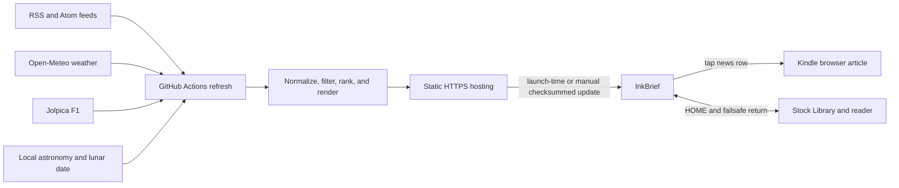

# InkBrief

InkBrief is a server-rendered, monochrome information dashboard for one
explicitly supported device: the **Kindle 11th generation (2022), model code
KT5, on firmware 5.19.2.0.1**. It generates five 1072×1448 PNG pages on a
normal Python host, publishes content-addressed releases, and displays them on
a jailbroken Kindle through KUAL and FBInk.

The dashboard is optional and launched manually. It does not replace the stock
launcher, install a boot hook, write books, or add anything to the Kindle
Library. A visible **HOME** target, a corner-hold failsafe, a runtime limit, and
a KUAL stop action all return to the stock interface.

> [!CAUTION]
> Jailbreaking is a separate, physical operation with real device risk. The
> included installer refuses any model other than KT5 and any firmware other
> than 5.19.2.0.1. Read [Jailbreak and installation](docs/jailbreak-and-install.md)
> and [Recovery](docs/recovery.md) in full before connecting a Kindle.

## Pages

- Home overview
- Weather, astronomy, moon phase, and Chinese lunar date
- Formula 1 weekend and standings
- Morning brief with deterministic or optional AI-assisted summaries
- Categorized headlines; tap a rendered news row to open its original HTTPS
  article in the Kindle browser after explicitly enabling the browser-risk
  option in KUAL



The host performs all source collection and rendering. Each configured manual
Dashboard launch checks for a verified five-page bitmap release and falls back
to the last verified or bundled pages when offline; KUAL also keeps a separate
manual update action. Nothing runs at boot or on a device-side schedule, and
the stock Library remains the primary interface.

The bundled demo renders without network access or API keys:

```sh
python3 -m venv .venv
.venv/bin/python -m pip install -e '.[dev]'
PYTHONPATH=backend .venv/bin/python -m kindle_brief.cli validate \
  --config config/config.example.yaml --feeds config/feeds.yaml
PYTHONPATH=backend .venv/bin/python -m kindle_brief.cli preview \
  --config config/config.example.yaml --feeds config/feeds.yaml \
  --output previews --demo
```

Use Python 3.11 or newer. CI uses Python 3.13. `PYTHONPATH=backend` is explicit
in commands and workflows so execution is independent of editable-install
path handling.

## Live generation

No AI key is required. The default provider ranks and summarizes locally and
deterministically.

```sh
PYTHONPATH=backend .venv/bin/python -m kindle_brief.cli build \
  --config config/config.example.yaml --feeds config/feeds.yaml \
  --cache .cache/kindle-brief --output public --live
```

Live generation contacts the configured weather, Formula 1, and RSS sources.
It uses a last-success cache for bounded degraded operation. A cold run without
enough source data fails instead of publishing a misleading blank dashboard.

## Device boundary

No backend or rendering command touches a mounted Kindle. Device mutation only
begins when the user explicitly runs `kindle/install/install.sh` against a
validated USB mass-storage mount. The installer writes only these owned paths:

- `/mnt/us/kindle-brief`
- `/mnt/us/extensions/Dashboard`

It preserves `documents`, Calibre metadata, books, the stock UI, and unrelated
extensions. Uninstall removes only paths carrying InkBrief ownership
markers; it does not remove the jailbreak.

## Documentation

- [Architecture](docs/architecture.md)
- [Configuration](docs/configuration.md)
- [Data sources and attribution](docs/data-sources.md)
- [Verified Formula 1 2026 calendar and circuits](docs/f1-2026.md)
- [AI quick guide](docs/ai.md)
- [AI providers](docs/ai-providers.md)
- [Rendering and release format](docs/rendering.md)
- [GitHub Pages publishing](docs/github-pages.md)
- [Device install checklist](docs/device-install.md)
- [Jailbreak and installation](docs/jailbreak-and-install.md)
- [Firmware update safety](docs/firmware-safety.md)
- [Calibre and library safety](docs/calibre.md)
- [Rollback](docs/rollback.md)
- [Recovery and uninstall](docs/recovery.md)
- [Deployment log](docs/deployment-log.md)
- [Privacy and security](docs/privacy-security.md)
- [Validation](docs/validation.md)

InkBrief code and project-original assets are MIT-licensed. Bundled fonts
and track geometry retain their own terms under `assets/`; project-authorized
raster derivatives have a provenance record in `assets/PROVENANCE.md` without
asserting a third-party licence.

## Open source

InkBrief is public, MIT-licensed software. The default dashboard works without
an AI key; optional AI providers are BYOK and credentials must stay in local
environment variables or GitHub Actions secrets, never in the repository.

The stable internal Python module, CLI, and Kindle storage paths retain the
`kindle_brief` / `kindle-brief` compatibility names so existing installations
can upgrade safely. The product name and user-facing interface are InkBrief.

Contributions are welcome through issues and pull requests. Before proposing a
device-side change, read the security, recovery, and firmware-safety guidance.
